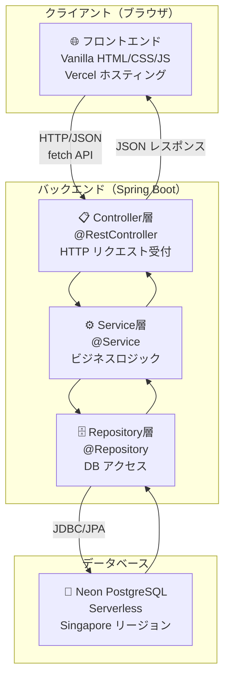
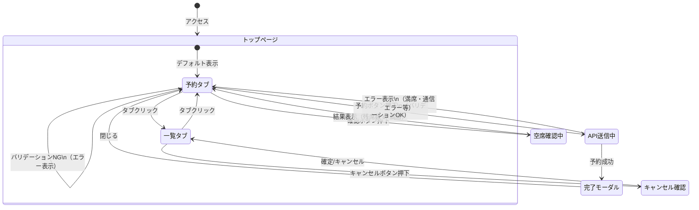

# 02. 基本設計書

## Bistro Lumiere - レストラン座席予約システム

---

## 1. 全体アーキテクチャ図



**ポイント: なぜ3層に分けるのか？**

> 例え話：レストランに例えると
> - **Controller**: ウェイター（お客様の注文を受け取り、料理を提供）
> - **Service**: 料理長（レシピと調理ルールを知っている）
> - **Repository**: 食材庫管理者（食材の出し入れだけに集中）
>
> 各層が役割を持つことで、変更が他層に波及しにくくなります。

---

## 2. 技術スタック

| 区分 | 技術 | バージョン | 役割 |
|------|------|-----------|------|
| 言語 | Java | 17 | バックエンド開発言語 |
| フレームワーク | Spring Boot | 3.2.5 | アプリケーション基盤 |
| ORM | Spring Data JPA / Hibernate | 6.x | DB操作の抽象化 |
| バリデーション | Jakarta Bean Validation | 3.x | 入力値チェック |
| セキュリティ | Spring Security | 6.x | CSRF・セキュリティヘッダー |
| ビルドツール | Maven | 3.x | 依存関係管理・ビルド |
| DB（本番） | Neon PostgreSQL | - | クラウドDB |
| DB（テスト） | H2 インメモリ | 2.x | テスト用軽量DB |
| フロントエンド | Vanilla JS / CSS | ES2020 | UI実装 |
| ホスティング（FE） | Vercel | - | 静的ファイルCDN配信 |

---

## 3. API 一覧

### ベースURL: `https://api.example.com/api`

| メソッド | パス | 機能 | ステータスコード |
|--------|------|------|----------------|
| POST | `/reservations` | 予約作成 | 201 Created / 400 / 409 |
| GET | `/reservations` | 全予約一覧取得 | 200 OK |
| GET | `/reservations/{id}` | 予約詳細取得 | 200 / 404 |
| DELETE | `/reservations/{id}` | 予約キャンセル（論理削除） | 200 / 404 / 409 |
| GET | `/reservations/date?date=yyyy-MM-dd` | 日付別予約一覧 | 200 |
| GET | `/reservations/availability?date=&time=` | 空席確認 | 200 |

### リクエスト例（予約作成）

```json
POST /api/reservations
Content-Type: application/json

{
  "guestName": "山田 太郎",
  "guestEmail": "yamada@example.com",
  "partySize": 2,
  "reservationDate": "2025-12-25",
  "reservationTime": "19:00:00",
  "specialRequest": "窓際の席を希望します"
}
```

### レスポンス例（予約作成成功）

```json
HTTP/1.1 201 Created

{
  "id": 42,
  "guestName": "山田 太郎",
  "guestEmail": "yamada@example.com",
  "partySize": 2,
  "reservationDate": "2025-12-25",
  "reservationTime": "19:00:00",
  "status": "CONFIRMED",
  "specialRequest": "窓際の席を希望します",
  "createdAt": "2025-11-01T10:30:00"
}
```

### エラーレスポンス例（満席）

```json
HTTP/1.1 409 Conflict

{
  "status": 409,
  "errorCode": "FULLY_BOOKED",
  "message": "申し訳ございません。2025年12月25日 19:00 は満席となっております。",
  "timestamp": "2025-11-01 10:30:00",
  "fieldErrors": null
}
```

---

## 4. 画面遷移図



---

## 5. CORS（クロスオリジン）設定

フロントエンド（Vercel）とバックエンドが異なるドメインに存在するため、
Spring Boot 側で CORS を許可します。

```
許可オリジン: 環境変数 ALLOWED_ORIGINS で設定
許可メソッド: GET, POST, PUT, DELETE, OPTIONS
許可ヘッダー: *（すべて）
プリフライトキャッシュ: 3600秒（1時間）
```

---

## 6. ディレクトリ構造

```
spring/
├── backend/                          # Spring Boot アプリケーション
│   ├── pom.xml                       # Maven 設定（依存関係管理）
│   └── src/
│       ├── main/
│       │   ├── java/com/bistrolumiere/reservation/
│       │   │   ├── ReservationApplication.java   # エントリーポイント
│       │   │   ├── config/
│       │   │   │   ├── CorsConfig.java           # CORS 設定
│       │   │   │   └── SecurityConfig.java       # Spring Security 設定
│       │   │   ├── controller/
│       │   │   │   └── ReservationController.java # REST API エンドポイント
│       │   │   ├── dto/
│       │   │   │   ├── ReservationRequest.java   # リクエスト DTO
│       │   │   │   └── ReservationResponse.java  # レスポンス DTO
│       │   │   ├── entity/
│       │   │   │   └── Reservation.java          # JPA エンティティ
│       │   │   ├── exception/
│       │   │   │   ├── BusinessException.java    # カスタム例外
│       │   │   │   ├── ErrorResponse.java        # エラー DTO
│       │   │   │   └── GlobalExceptionHandler.java # 例外ハンドラー
│       │   │   ├── repository/
│       │   │   │   └── ReservationRepository.java # データアクセス層
│       │   │   └── service/
│       │   │       └── ReservationService.java   # ビジネスロジック
│       │   └── resources/
│       │       └── application.yml               # アプリ設定（環境変数参照）
│       └── test/
│           ├── java/com/bistrolumiere/reservation/
│           │   ├── controller/
│           │   │   └── ReservationControllerTest.java
│           │   └── service/
│           │       └── ReservationServiceTest.java
│           └── resources/
│               └── application-test.yml          # テスト専用設定（H2使用）
├── frontend/                         # Vercel 用静的ファイル
│   ├── index.html
│   ├── style.css
│   └── app.js
└── docs/                             # ドキュメント
    ├── 01_要件定義書.md
    ├── 02_基本設計書.md
    ├── 03_詳細設計書.md
    └── 04_単体・結合・総合テスト仕様書.md
```
