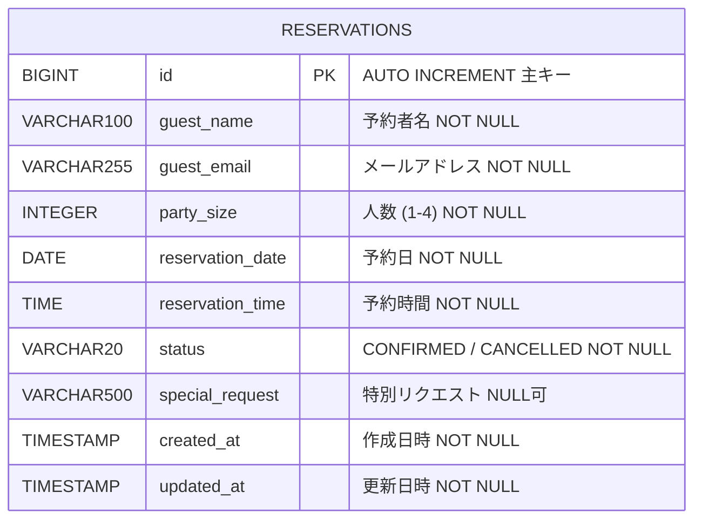
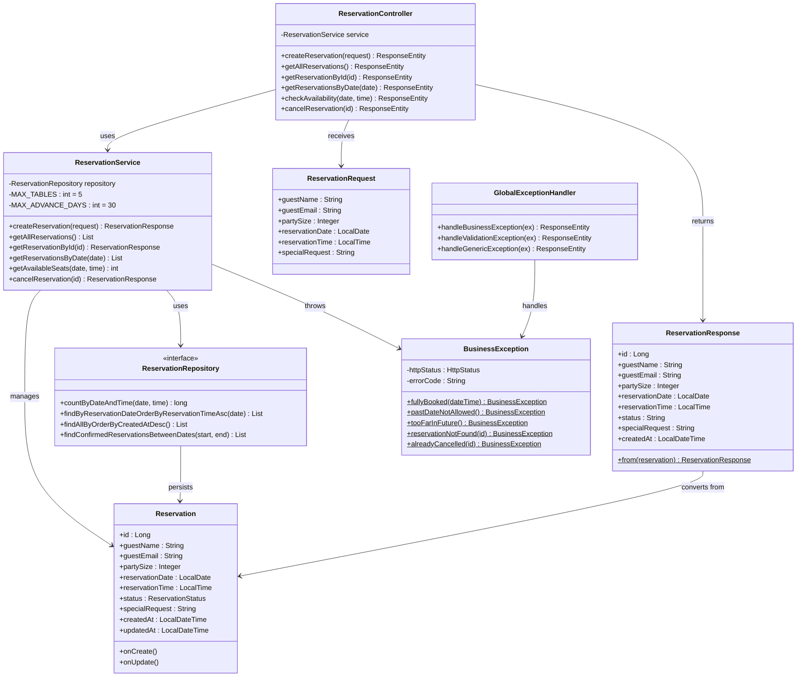
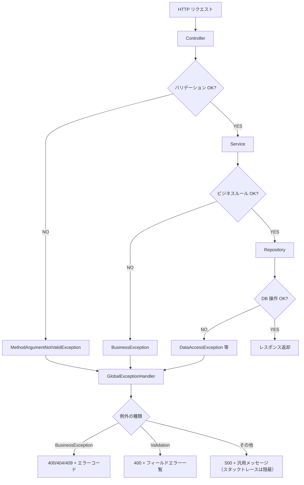

# 03. 詳細設計書

## Bistro Lumiere - レストラン座席予約システム

---

## 1. データベース設計（ER図）



### テーブル定義: `reservations`

| カラム名 | 型 | 制約 | 説明 |
|---------|-----|------|------|
| `id` | BIGINT | PK, AUTO_INCREMENT | 主キー（予約番号） |
| `guest_name` | VARCHAR(100) | NOT NULL | 予約者の氏名 |
| `guest_email` | VARCHAR(255) | NOT NULL | 予約者のメールアドレス |
| `party_size` | INTEGER | NOT NULL, CHECK(1-4) | 予約人数 |
| `reservation_date` | DATE | NOT NULL | 予約日 |
| `reservation_time` | TIME | NOT NULL | 予約時間 |
| `status` | VARCHAR(20) | NOT NULL, DEFAULT 'CONFIRMED' | ステータス |
| `special_request` | VARCHAR(500) | NULL | 特別なリクエスト |
| `created_at` | TIMESTAMP | NOT NULL | レコード作成日時（自動） |
| `updated_at` | TIMESTAMP | NOT NULL | レコード更新日時（自動） |

### インデックス設計

```sql
-- 空席確認クエリを高速化するための複合インデックス
-- 「特定の日付＆時間の予約数をカウント」する操作が頻繁に行われるため
CREATE INDEX idx_reservation_date_time ON reservations (reservation_date, reservation_time);

-- 日付別一覧取得クエリの高速化
CREATE INDEX idx_reservation_date ON reservations (reservation_date);
```

---

## 2. クラス図



---

## 3. トランザクション制御設計

### 3-1. ダブルブッキング防止のトランザクション設計

```
問題: ユーザーAとユーザーBが同時に同じ時間帯に予約しようとした場合

【トランザクションなしの場合（問題あり）】
  ユーザーA: 空席確認 → 残り1席あり
  ユーザーB: 空席確認 → 残り1席あり  ← 同時に確認！
  ユーザーA: 予約作成（成功）
  ユーザーB: 予約作成（成功）← ダブルブッキング発生！

【@Transactional を使った場合（解決）】
  ユーザーA: トランザクション開始 → 空席確認 → 予約作成 → コミット
  ユーザーB: トランザクション開始 → 空席確認（Aのコミット後）→ 満席 → ロールバック
```

```java
// Service 層のトランザクション設定
@Transactional            // 書き込みあり（INSERT/UPDATE）
public ReservationResponse createReservation(...) { ... }

@Transactional(readOnly = true)  // 読み取りのみ（SELECT）→ 高速化
public List<ReservationResponse> getAllReservations() { ... }
```

### 3-2. トランザクション分離レベル

```
Spring Boot のデフォルト分離レベル: READ_COMMITTED
（DBのデフォルトに従う = PostgreSQL の READ COMMITTED）

READ_COMMITTED の特性:
  - コミット済みのデータのみ読み取れる
  - ダーティリード（未コミットデータの読み取り）を防止
  - ファントムリード（トランザクション中に別のINSERTが見える）は発生しうる

本番での強化策:
  - SELECT FOR UPDATE（悲観的ロック）で完全なダブルブッキング防止
  - またはアプリケーション層での楽観的ロック（バージョンカラム使用）
```

---

## 4. 例外処理設計



### エラーコード一覧

| エラーコード | HTTP | 発生条件 |
|------------|------|---------|
| `VALIDATION_FAILED` | 400 | Bean Validation によるバリデーションエラー |
| `PAST_DATE_NOT_ALLOWED` | 400 | 過去の日付に予約しようとした |
| `TOO_FAR_IN_FUTURE` | 400 | 1ヶ月より先の日付に予約しようとした |
| `FULLY_BOOKED` | 409 | 指定日時が満席（5組以上） |
| `RESERVATION_NOT_FOUND` | 404 | 指定IDの予約が存在しない |
| `ALREADY_CANCELLED` | 409 | すでにキャンセル済みの予約をキャンセルしようとした |
| `INTERNAL_SERVER_ERROR` | 500 | 予期しない例外（バグ等） |

---

## 5. セキュリティ設計詳細

### 5-1. SQLインジェクション対策

Spring Data JPA（Hibernate）はすべてのパラメーターを**プリペアドステートメント**で処理します。

```java
// NG: 文字列結合でのSQL（SQLインジェクション脆弱性あり）
String sql = "SELECT * FROM reservations WHERE guest_name = '" + name + "'";

// OK: JPA（プリペアドステートメントを自動で使用）
reservationRepository.findByGuestName(name); // 安全！
```

### 5-2. XSS対策（フロントエンド）

```javascript
// NG: innerHTML にユーザーデータを混入（XSS脆弱性あり）
element.innerHTML = '<p>' + userData + '</p>'; // ← 危険！

// OK: textContent を使用（HTMLとして解釈されない）
element.textContent = userData; // ← 安全！
```

### 5-3. Spring Security のセキュリティヘッダー

Spring Security が自動で以下のヘッダーを付与します：

```http
X-Content-Type-Options: nosniff
X-Frame-Options: DENY
X-XSS-Protection: 1; mode=block
Cache-Control: no-cache, no-store, max-age=0, must-revalidate
```

---

## 6. Dependency Injection（依存性注入）の詳細設計

```
【従来のやり方（DI なし）】
class ReservationService {
    private ReservationRepository repo = new ReservationRepository(); // 自前でnew
}
問題点:
  - テスト時に ReservationRepository を差し替えられない（DB必須になる）
  - ReservationRepository の生成方法が変わったら全箇所修正が必要

【Spring DI を使った場合】
@Service
@RequiredArgsConstructor
class ReservationService {
    private final ReservationRepository repo; // Spring が自動で注入
}
メリット:
  - テスト時に MockRepository を差し替えられる（@Mock, @MockBean）
  - 実装の詳細を知らなくて済む（インターフェースに依存）
  - 生成・管理・廃棄をSpringが担当（ライフサイクル管理）
```

この「部品を外から渡す」パターンが **Dependency Injection（依存性の注入）** です。
コンストラクタインジェクションが Spring の公式推奨です。
